# Sapient.X

*Powered by AGI Corp*

**Four small-business problems. One action each. Every answer tested before it is allowed to appear.**
Detection is solved; the next step is not. Every small shop already has data that says what went wrong: the marketplace shows the return rate, the camera fires when someone pockets an item, the ad dashboard has a "winner", the POS has last week's sales. Nobody has told the one person standing there, alone at 7am, what to do next. Sapient.X takes a signal the business already has and returns one action: the cause of a SKU's returns with the buyer's own words as proof and a fix to paste; the prep number per item; the one ad change worth making this week; the sentence to say and where to stand in the ten seconds after a theft alert. Where a model is involved, its prompt was written by a meta-prompt, scored on golden cases, and only shipped when it beat the previous version.

Built by [AGI Future Foundation](ABOUT.md) for the ITCHATHON hackathon (27 Sep 2026).


[Watch the 90-second demo](media/demo.mp4) · [110-second judging video](media/judging-demo.mp4) ([hosted player](https://claude.ai/artifact/Vg2oJWQqKyAuqKpbvVkqWn)) · [Pitch deck](pitch/deck.html) ([hosted](https://claude.ai/artifact/SNj8L1jEPfoqbB2RWskbaH)) · [Judging criteria, self-scored](docs/JUDGING.md) · [Live pitch page](https://claude.ai/artifact/ChLDi9GPBXPhhjycapP5Mn) · [Whitepaper](docs/WHITEPAPER.md) · [Wiki](docs/wiki/Home.md)

<details><summary>Gate performance across all four modules (scaling caveats in the image caption — axes are not directly comparable)</summary>

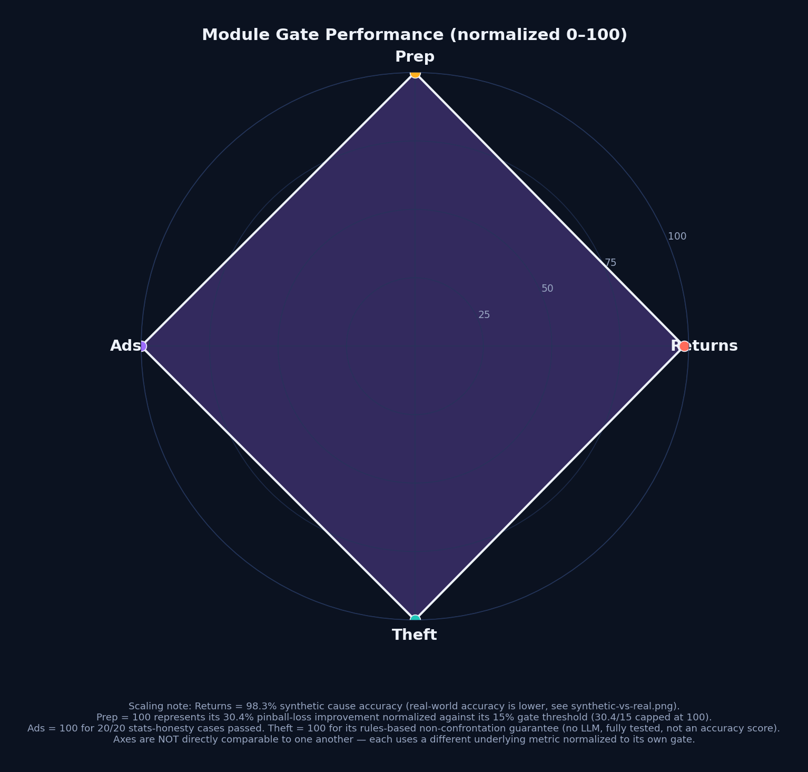

</details>

`eval gate: met` · `returns prompt: v6 served (91.7% synthetic / 66.7% real-30)` · `4 modules` · `Node 24, zero npm dependencies in the app` · `MIT`

---

## Contents

- [What it does](#what-it-does)
- [How it was built](#how-it-was-built)
- [Quick start](#quick-start)
- [API reference](#api-reference)
- [Evals](#evals)
- [Enterprise and compliance](#enterprise-and-compliance)
- [Roadmap](#roadmap)
- [Team and credits](#team-and-credits)
- [License](#license)

---

## What it does

One Node process serves four modules behind one platform layer. Each module answers one owner question and is either deterministic or has passed an eval gate.

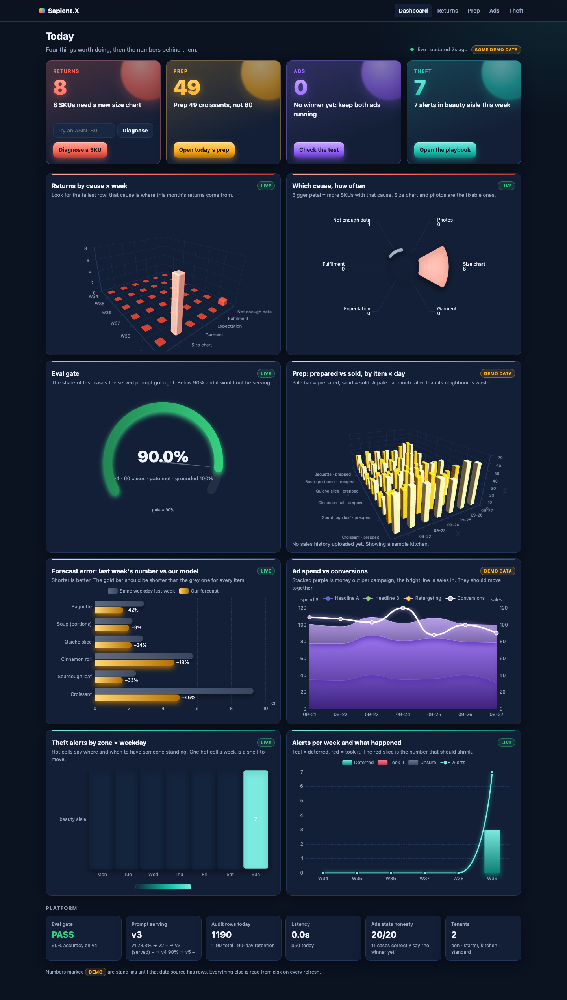

### Why Did It Come Back? (returns root-cause) — Challenge 1

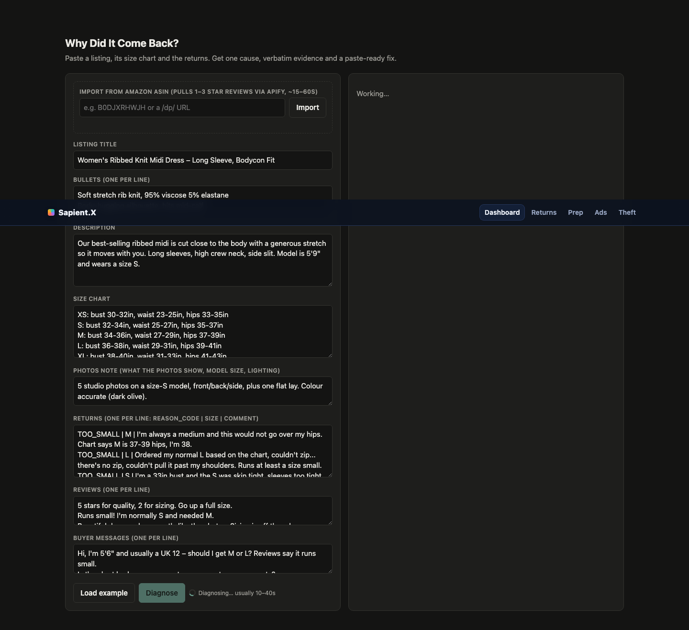

Paste a listing, its size chart, the returns with reason codes and comments, reviews and buyer messages. Get back **one cause** per SKU (`photos | size_chart | garment | expectation | fulfilment | not_enough_data`), **verbatim evidence** checked by code against the input, a **paste-ready fix** for the listing, and a **keep-size message** to send buyers before they order. Fewer than three returns and no clear signal returns `not_enough_data`: four returns are four sentences, not a statistic.

**Measured** (`evals/returns/results/v1.log`, `v2.log`, 60 golden cases, Sonnet):

| Version | Cause accuracy | Hard 20 (c41–c60) | Grounded | Low-data honesty | Mean latency | Gate |
|---|---|---|---|---|---|---|
| v1 | 78.3% | 85% | 88.3% | 83.3% | 25.0 s | not met |
| v2 | **98.3%** | **100%** | **95%** | **100%** | 15.1 s | **met** |

v1's confusion was garment ↔ size_chart (4 of 12 garment cases called size_chart). The failure report went back into the meta-prompt and v2 fixed it in one loop. Remaining v2 misses: one malformed JSON (c08), two lightly paraphrased quotes (c30, c55).

**Real data, honestly:** the same v2 prompt run on 10 cases built from real Amazon reviews pulled through Apify (`evals/returns/cases_real.jsonl`, title and description only, no size chart) scored 4/10 cause accuracy with 100% grounding (`STATUS.md`). That gap is the input to the next meta-prompt loop, not a footnote. You can also paste just an ASIN: `POST /api/import-asin` pulls the critical reviews and reshapes them into the diagnose input. Details: [Module-Returns](docs/wiki/Module-Returns.md).

### Today's Prep — Challenge 4

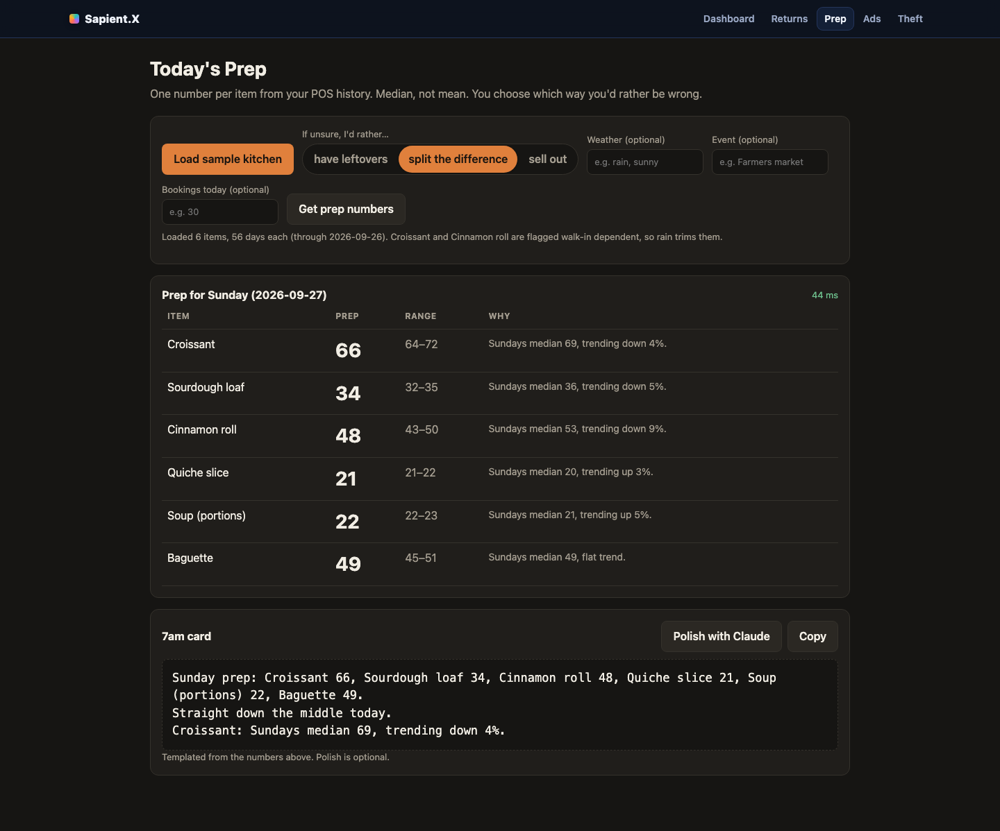

POS history per item, the owner's preference (`run_out | neutral | waste`), and today's context (bookings, events, weather) in; **one prep number per item** with a range and a one-sentence reason out, plus an optional three-line 7am card. Pure math, no model: same-weekday quantile over the last 8 weeks, times a 2-week trend clamped to 0.8–1.25, times context multipliers.

**Measured** (`evals/prep/results.json`, 6 items, 84 days, 14-day holdout): pinball loss **2.88 vs 4.14** for the owner's habit of "same weekday last week", a **30.4% improvement** (gate: ≥ 15%). Better on every item; the Python backtest and the Node module agree on all 18 forecasts. Details: [Module-Prep](docs/wiki/Module-Prep.md).

### Ads Plain Read — Challenge 2

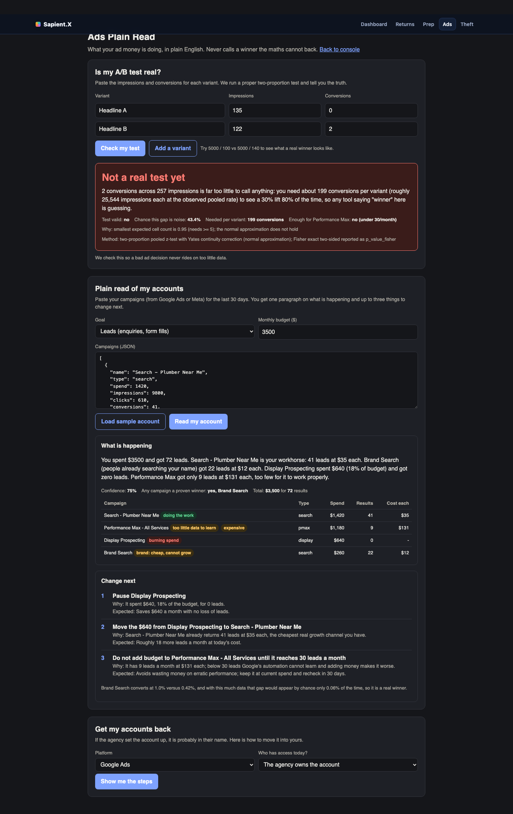

A campaign export, the goal and the budget in; **what is happening in plain English** and **one to three concrete changes** out, with `test_is_valid` computed by a real two-proportion z-test (Yates correction, Fisher exact alongside) that the model is not allowed to flip. No "winner" is ever called when the expected cell counts are below 5 or p ≥ 0.05. Also a no-LLM account-ownership checklist for Google and Meta.

**Measured** (`evals/ads/results.json`, 20 cases): **stats honesty 100%**, gate met. Case a01 is the hackathon case (135/0 vs 122/2 impressions/conversions, where a calculator said "winner"): the module says `no winner yet`. Details: [Module-Ads](docs/wiki/Module-Ads.md).

### Ten Seconds After (theft) — Challenge 3

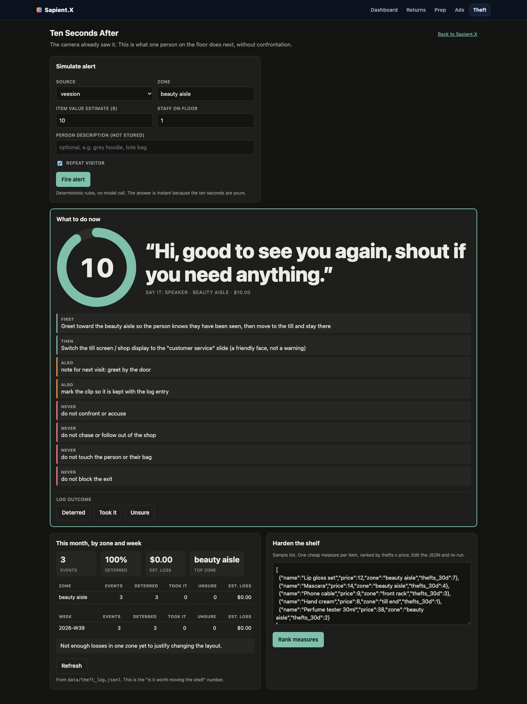

A camera or Veesion alert (zone, item value, staff on floor, repeat visitor) in; **one primary action, one secondary action, a customer-service script, a channel and a ten-second timer** out. Rules table, **no LLM**: the answer arrives in under a second, is identical every time for the same alert, and every response carries the same four hard rules: do not confront or accuse, do not chase, do not touch, do not block the exit. `person_description` is never written to disk. A monthly summary by zone and week says when it is worth moving a shelf. Details: [Module-Theft](docs/wiki/Module-Theft.md).

---

## How it was built

No product prompt is written by hand. `prompts/meta/master.md` is the meta-prompt; it writes every `prompts/<module>/vN.md` from the input/output contract plus the failure report of the last eval run. Seven Claude Code subagents split the work; the eval runner scores each version; a version becomes "newest" (and therefore serves traffic) only when it beats the previous one.

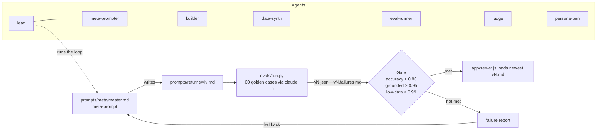

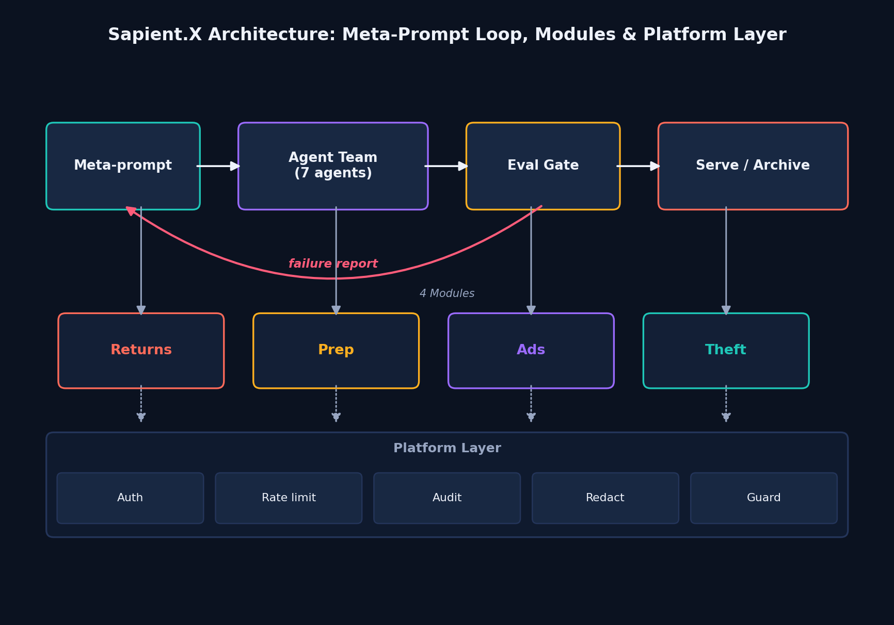

The build itself ran as one hour with 15-minute checkpoints (the log is on the pitch page): v1 at 0:14, eval v1 at 0:19 (78.3%), scope widened to all four challenges at 0:23, eval v2 at 0:29 (98.3%, gate met). Read more: [Eval-Loop-and-Meta-Prompting](docs/wiki/Eval-Loop-and-Meta-Prompting.md), [Agent-Team](docs/wiki/Agent-Team.md).

---

## Quick start

Requirements: Node 24, the Claude Code CLI on `PATH` (`claude -p` is what the LLM modules shell out to), Python 3 for the evals.

```bash
git clone https://github.com/AGIFutureFoundation/Itchathon-tools.git
cd Itchathon-tools
cp .env.example .env          # fill in ANTHROPIC_API_KEY; REQUIRE_AUTH=0 for the demo
node app/server.js            # → http://localhost:3141
```

Pages: `/` (dashboard), `/index.html` (returns), `/asin-import.html`, `/prep.html`, `/ads.html`, `/theft.html`. Health: `GET /api/health`.

**Docker**

```bash
docker compose up --build     # port 3141; ./data and ./prompts are mounted
```

`docker-compose.yml` mounts `./data` (audit rows, theft log) and `./prompts` read-only, so a new prompt version ships without a rebuild.

**Demo API keys** (`config/tenants.json`, placeholders, not secrets):

| Key | Tenant | Plan | Modules | Rate limit |
|---|---|---|---|---|
| `demo-key-ben` | ben | starter | returns, prep, ads, theft | 60/min |
| `demo-key-kitchen` | kitchen | standard | returns, ads | 120/min |

```bash
curl -s localhost:3141/api/theft/summary -H 'Authorization: Bearer demo-key-kitchen'
# → 403 {"error":"module theft not enabled for tenant"}
```

Without a key and with `REQUIRE_AUTH=0`, requests run as tenant `default` with every module. A key that is present but unknown is always rejected. See [Deployment](docs/wiki/Deployment.md).

---

## API reference

All routes accept and return JSON. Auth: `Authorization: Bearer <key>` (optional in demo mode). Every LLM-backed response carries `_meta: { prompt_source, model, latency_ms }`.

| Method | Route | Module | LLM | Purpose |
|---|---|---|---|---|
| POST | `/api/diagnose` | returns | yes | One cause, verbatim evidence, paste-ready fix, keep-size message for one SKU |
| POST | `/api/import-asin` | apify | no | Pull critical Amazon reviews for one ASIN via Apify and reshape them into the diagnose input |
| POST | `/api/prep/forecast` | prep | no | Prep quantity, range and reason per item |
| POST | `/api/prep/explain` | prep | optional | Three-line 7am card (template fallback) |
| POST | `/api/ads/stats` | ads | no | Two-proportion z-test, Fisher exact, sample-size floor, verdict |
| POST | `/api/ads/read` | ads | yes | Plain-English account read with enforced contract (template fallback) |
| POST | `/api/ads/ownership` | ads | no | Account-ownership checklist for `google` or `meta` |
| POST | `/api/theft/alert` | theft | no | Ten-second playbook for one alert |
| POST | `/api/theft/log` | theft | no | Record the outcome (`deterred | took_it | unsure`) |
| GET | `/api/theft/summary` | theft | no | Alerts and outcomes by zone and ISO week, decision hint |
| POST | `/api/theft/harden` | theft | no | One cheap measure per item, ranked by thefts × price |
| GET | `/api/dashboard/summary` | dashboard | no | One JSON the home page charts from (live where data exists, `demo:true` otherwise) |
| GET | `/api/health` | — | no | Served prompt version, model, mounted modules, platform flags |

Request and response shapes: [API-Reference](docs/wiki/API-Reference.md) and [Data-Model](docs/wiki/Data-Model.md).

---

## Evals

```bash
# Returns: 60 golden cases through claude -p; writes results/vN.json and vN.failures.md; exit 1 if the gate fails
python3 evals/run.py --prompt prompts/returns/v2.md --workers 6

# Prep: 12 weeks of synthetic POS, 14-day holdout, pinball loss vs "same weekday last week"; cross-checks Node
python3 evals/prep/backtest.py

# Ads: 20 cases through the same computeStats the server uses; gate is 100% agreement on test_is_valid
python3 evals/ads/run.py

# Platform: redaction, guard, retention
node --test tests/
```

Gates: returns `cause_accuracy ≥ 0.80`, `grounded_rate ≥ 0.95`, `low_data_ok_rate ≥ 0.99`; prep `improvement ≥ 15%`; ads `stats_honesty_rate == 1.0`; theft is rules-only and has no model to gate. To write the next returns prompt from the newest failure report: `python3 prompts/meta/generate.py`.

**Returns, v1 → v4 on the 60-case synthetic gate:**

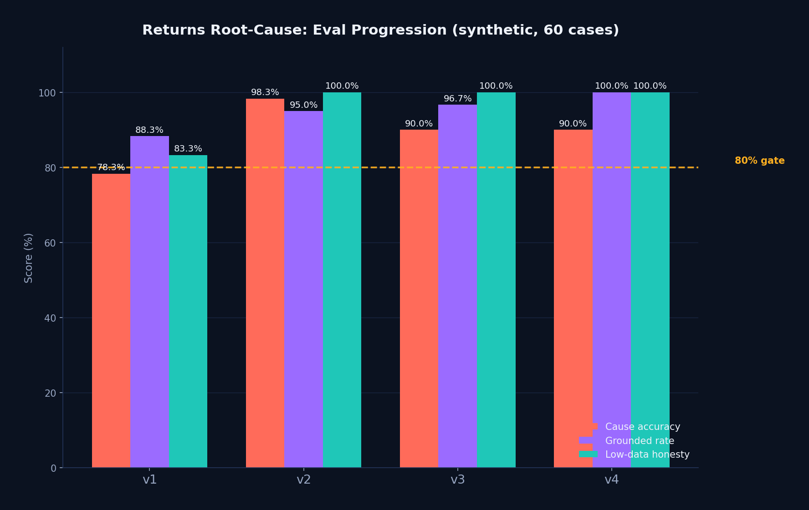

**The honest headline — synthetic gate passing is not the same as real-world accuracy:**

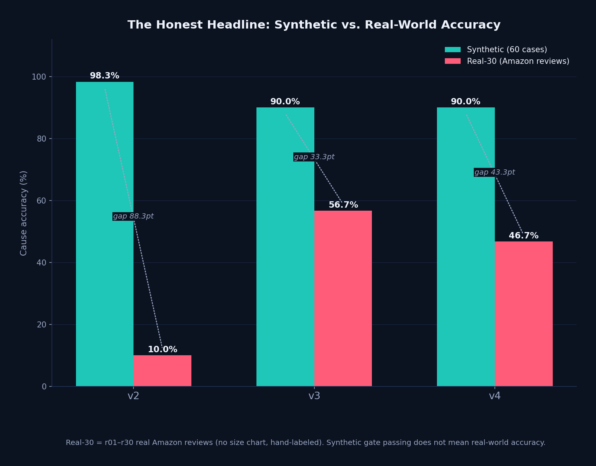

v3's confusion matrix on the 60 synthetic cases (the currently served version):

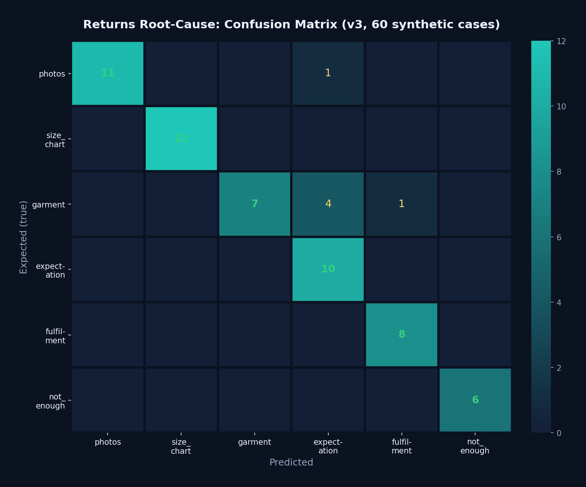

**Prep beats the habit** (same-weekday-last-week) by 30.4% on pinball loss:

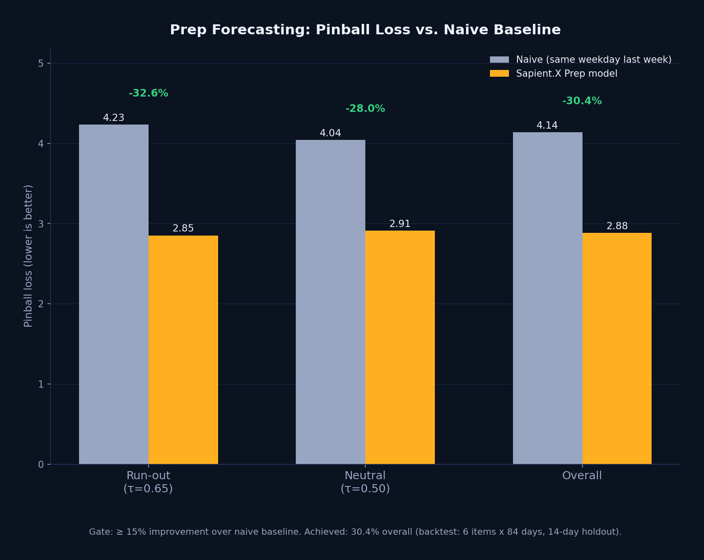

---

## Enterprise and compliance

- **Multi-tenant** from the first line: every request has a tenant, a plan and a module list; rate limits (token bucket, 60/min default) and audit are per tenant.
- **Versioned prompts with scores.** The served version is stamped into `_meta.prompt_source` and into the audit row.
- **Every answer is traceable**: `data/audit/<day>.jsonl` rows hold `tenant, module, prompt_version, model, latency_ms, input_sha256, result_summary`. Never the input.
- **PII redaction before any model call** (`[EMAIL_1]`, `[PHONE_1]`, `[ORDER_1]`, `[CARD_1]`, `[IBAN_1]`, `[ADDRESS_1]`; Luhn and IBAN mod-97 validated). Buyer text is wrapped as `<untrusted_buyer_text>`; an injection heuristic scores it; the output guard rejects non-verbatim evidence, URLs, off-marketplace contact advice and prompt leaks.
- **Retention**: audit 90 days, raw imports 30 days, theft log 365 days with `person_description` blanked after 24 hours (`node app/platform/retention.js --dry-run`).
- **Compliance mapped per module**: GDPR/CCPA roles and Amazon's Data Protection Policy for returns; Google/Meta API terms and FTC substantiation (the statistics floor) for ads; no biometrics, CCTV signage and employee-safety rules for theft.

Read: [Platform-Layer](docs/wiki/Platform-Layer.md) · [Compliance](docs/wiki/Compliance.md) · [Security](docs/wiki/Security.md) · [docs/COMPLIANCE.md](docs/COMPLIANCE.md) · [docs/ARCHITECTURE.md](docs/ARCHITECTURE.md)

---

## Roadmap

- Pilots with real owners on the four modules, with the eval loop running on their cases.
- Returns v3: close the synthetic-vs-real gap (98.3% vs 40%) using `evals/returns/results/v2_real.failures.md` as the meta-prompt's failure report; real listings often lack a size chart, so the prompt must weigh review text more.
- Prep and ads: a POS feed and an ad-account connection to replace the dashboard's deterministic demo series.
- Judge calibration (agree within one point on ≥ 12 of 15 hand-scored outputs) and the persona-Ben gate (yes on ≥ 70% of outputs) added to the release gate.
- Tenants from a table instead of `tenants.json`: a one-module change behind `auth.js`.

Full list: [Roadmap](docs/wiki/Roadmap.md).

---

## Team and credits

Built by AGI Future Foundation with a team of seven Claude Code subagents (lead, meta-prompter, builder, data-synth, eval-runner, judge, persona-ben). Product prompts were written by Opus from the master meta-prompt; evals ran on Sonnet. The challenge brief and the seller quotes on the pitch page come from the ITCHATHON Challenges brief (27 Sep 2026) and the Reddit threads it cites. See [ABOUT.md](ABOUT.md) and [CONTRIBUTING.md](CONTRIBUTING.md).

## License

MIT, copyright 2026 AGI Future Foundation. See [LICENSE](LICENSE).
